# 🔍 Spam Detection Algorithm Documentation

> **Comprehensive guide to DELCOM's Hybrid Spam Detection System**

## 📋 Table of Contents

- [Overview](#overview)
- [System Architecture](#system-architecture)
- [Scanning Process Flow](#scanning-process-flow)
- [Spam Detection Pipeline](#spam-detection-pipeline)
- [Detection Components](#detection-components)
- [Scoring System](#scoring-system)
- [Decision Logic](#decision-logic)
- [API Integration](#api-integration)
- [Examples](#examples)

---

## Overview

DELCOM's spam detection system focuses on **what YouTube/Instagram/TikTok CAN'T detect**:

### ❌ What Platforms Already Handle
- Regex keyword matching
- Basic spam patterns
- Simple text filters

### ✅ What DELCOM Detects
- **Bot Campaign Detection** - Coordinated spam attacks with similar patterns
- **Unicode Bypass Detection** - Fancy fonts used to evade filters (𝗝𝗨𝗗𝗢𝗟 → JUDOL)
- **Contextual Analysis** - Reduces false positives (educational vs promotional)
- **Implicit Patterns** - Gambling/scam patterns without obvious keywords

---

## System Architecture


---

## Scanning Process Flow

### Complete Sequence Diagram


---

## Spam Detection Pipeline

### High-Level Pipeline

```mermaid
flowchart LR
    A[Raw Comments] --> B[Normalization]
    B --> C[Cluster Detection]
    C --> D[Pattern Analysis]
    D --> E[Context Analysis]
    E --> F[Scoring]
    F --> G{Score >= 70?}
    G -->|Yes| H[SPAM ❌]
    G -->|No| I[CLEAN ✅]
```



### Detailed Processing Steps

```mermaid
graph TD
    Start([Input: Comment Batch]) --> Step1[Step 1: Normalization]

    Step1 --> Step1a[Unicode → ASCII]
    Step1 --> Step1b[Lowercase]
    Step1 --> Step1c[Trim whitespace]

    Step1a --> Step2[Step 2: Cluster Detection]
    Step1b --> Step2
    Step1c --> Step2

    Step2 --> Step2a{Find Similar<br/>Comments}
    Step2a -->|Similarity > 70%| Step2b[Group into Cluster]
    Step2a -->|Similarity < 70%| Step2c[Individual Comment]

    Step2b --> Step3[Step 3: Extract Template]
    Step2c --> Step3

    Step3 --> Step3a["Template:<br/>'wd [N]jt 🤑'"]

    Step3a --> Step4[Step 4: Pattern Analysis]

    Step4 --> Step4a{Money<br/>Keywords?}
    Step4 --> Step4b{Urgency<br/>Language?}
    Step4 --> Step4c{Link<br/>Promotion?}
    Step4 --> Step4d{Emoji<br/>Density?}
    Step4 --> Step4e{CAPS<br/>Ratio?}

    Step4a -->|Yes| Score1[+10 pts]
    Step4b -->|Yes| Score2[+10 pts]
    Step4c -->|Yes| Score3[+15 pts]
    Step4d -->|High| Score4[+5 pts]
    Step4e -->|High| Score5[+5 pts]

    Score1 --> Step5[Step 5: Context Analysis]
    Score2 --> Step5
    Score3 --> Step5
    Score4 --> Step5
    Score5 --> Step5

    Step5 --> Step5a{Educational<br/>Content?}
    Step5 --> Step5b{Question<br/>Pattern?}
    Step5 --> Step5c{Warning<br/>Context?}

    Step5a -->|Yes| Adjust1[-30 pts]
    Step5b -->|Yes| Adjust2[-20 pts]
    Step5c -->|Yes| Adjust3[-25 pts]

    Adjust1 --> Step6[Step 6: Calculate Total]
    Adjust2 --> Step6
    Adjust3 --> Step6

    Step6 --> Decision{Total >= 70?}

    Decision -->|Yes| Spam[MARK AS SPAM ❌]
    Decision -->|No| Clean[ALLOW ✅]

    Spam --> End([Output: Spam Report])
    Clean --> End
```



---

## Detection Components

### 1. Cluster Detection (Bot Campaign)

```mermaid
graph LR
    subgraph "Input Comments"
        C1["Comment 1:<br/>'Gw wd 5jt 🤑'"]
        C2["Comment 2:<br/>'Gw wd 3jt 🤑'"]
        C3["Comment 3:<br/>'Gw wd bilek 🤑'"]
        C4["Comment 4:<br/>'Nice video!'"]
    end

    subgraph "Similarity Analysis"
        C1 --> S1{Levenshtein<br/>Distance}
        C2 --> S1
        C3 --> S1
        C4 --> S2{Levenshtein<br/>Distance}

        S1 -->|< 30% diff| Cluster[Cluster A<br/>3 members]
        S2 -->|> 30% diff| Single[No Cluster]
    end

    subgraph "Template Extraction"
        Cluster --> T1["Pattern:<br/>'Gw wd [N]jt 🤑'"]
        T1 --> Score["+25 points<br/>(Cluster size)"]
    end

    Single --> NoScore["0 points"]
```



**Algorithm:**
```javascript
function findClusters(comments) {
    clusters = []
    processed = []

    for (i = 0; i < comments.length; i++) {
        if (processed.includes(i)) continue

        cluster = [comments[i]]

        for (j = i+1; j < comments.length; j++) {
            if (processed.includes(j)) continue

            similarity = calculateSimilarity(
                comments[i].text,
                comments[j].text
            )

            if (similarity > 0.7) {  // 70% similar
                cluster.push(comments[j])
                processed.push(j)
            }
        }

        if (cluster.length >= 2) {
            clusters.push(cluster)
        }
    }

    return clusters
}
```

### 2. Unicode Detection

```mermaid
graph TD
    Input["Input: '𝗝𝗨𝗗𝗢𝗟 𝗚𝗔𝗖𝗢𝗥 🎰'"] --> Detect{Has Fancy<br/>Unicode?}

    Detect -->|Yes| Ranges[Check Unicode Ranges]
    Detect -->|No| Clean[Regular Text]

    Ranges --> R1[Mathematical Bold:<br/>0x1D400-0x1D433]
    Ranges --> R2[Fullwidth Latin:<br/>0xFF21-0xFF5A]
    Ranges --> R3[Circled:<br/>0x24B6-0x24E9]

    R1 --> Found{Found?}
    R2 --> Found
    R3 --> Found

    Found -->|Yes| Normalize[Normalize to ASCII]
    Normalize --> Result["Output: 'JUDOL GACOR 🎰'"]
    Result --> Flag["+15 SPAM points"]

    Found -->|No| Clean
    Clean --> NoFlag["0 points"]
```



### 3. Pattern Analysis


### 4. Context Analysis (False Positive Filter)


---

## Scoring System

### Score Breakdown


### Scoring Formula

| Component | Condition | Points |
|-----------|-----------|--------|
| **Cluster Size** | 2 similar comments | +20 |
| | 3-4 similar comments | +25 |
| | 5+ similar comments | +40 |
| **Template Specificity** | Generic template | +10 |
| | Moderate specificity | +20 |
| | High specificity | +30 |
| **Money Keywords** | Contains 1+ money terms | +10 |
| **Urgency Language** | Contains 1+ urgency words | +10 |
| **Link Promotion** | Contains call-to-action | +15 |
| **Emoji Density** | > 15% of text | +5 |
| **CAPS Ratio** | > 50% uppercase | +5 |
| **Author Diversity** | Same author (bot) | +20 |
| | Multiple authors (coordinated) | +10 |
| **Unicode Detection** | Fancy fonts detected | +15 |
| **Educational Context** | Educational content | -30 |
| **Question Pattern** | Legitimate question | -20 |
| **Warning Context** | Cautionary content | -25 |

### Threshold

```mermaid
graph LR
    S[Score] --> D{Value}
    D -->|0-39| Low[Low Risk<br/>✅ CLEAN]
    D -->|40-69| Medium[Medium Risk<br/>⚠️ REVIEW]
    D -->|70-100| High[High Risk<br/>❌ SPAM]
```



---

## Decision Logic

### Spam Detection Decision Tree

```mermaid
graph TD
    Start([New Comment]) --> Q1{Part of<br/>Cluster?}

    Q1 -->|Yes, 5+ members| Score1[Score: +40]
    Q1 -->|Yes, 2-4 members| Score2[Score: +20]
    Q1 -->|No| Score3[Score: 0]

    Score1 --> Q2{Has Fancy<br/>Unicode?}
    Score2 --> Q2
    Score3 --> Q2

    Q2 -->|Yes| Score4[Score: +15]
    Q2 -->|No| Q3

    Score4 --> Q3{Money<br/>Keywords?}

    Q3 -->|Yes| Score5[Score: +10]
    Q3 -->|No| Q4

    Score5 --> Q4{Urgency<br/>Language?}

    Q4 -->|Yes| Score6[Score: +10]
    Q4 -->|No| Q5

    Score6 --> Q5{Link<br/>Promotion?}

    Q5 -->|Yes| Score7[Score: +15]
    Q5 -->|No| Q6

    Score7 --> Q6{Educational<br/>Content?}

    Q6 -->|Yes| Adjust1[Score: -30]
    Q6 -->|No| Q7

    Adjust1 --> Q7{Question<br/>Pattern?}

    Q7 -->|Yes| Adjust2[Score: -20]
    Q7 -->|No| Total

    Adjust2 --> Total[Calculate Total]

    Total --> Final{Total >= 70?}

    Final -->|Yes| Spam[🚨 SPAM<br/>Delete/Hide]
    Final -->|No| Clean[✅ CLEAN<br/>Allow]
```



---

## API Integration

### Platform Service Architecture


### Rate Limiting Flow


---

## Examples

### Example 1: Bot Campaign Detection

**Input Comments:**
```json
[
  { "id": "1", "text": "Gw yang habis wd 5jt 🤑", "author": "bot123" },
  { "id": "2", "text": "Gw yang habis wd 3jt 🤑", "author": "bot123" },
  { "id": "3", "text": "Gw yang habis wd bilek 🤑", "author": "bot123" },
  { "id": "4", "text": "Nice video!", "author": "realuser" }
]
```

**Processing:**


**Output:**
```json
{
  "spam_campaigns": [
    {
      "score": 60,
      "severity": "MEDIUM",
      "member_count": 3,
      "template": "gw yang habis wd [N]",
      "comment_ids": ["1", "2", "3"],
      "authors": ["bot123"],
      "signals": [
        "Cluster size: 3 (+25)",
        "Money mentions (+10)",
        "Low author diversity (+20)",
        "High emoji density (+5)"
      ],
      "recommendation": "Review manually"
    }
  ]
}
```

### Example 2: Unicode Bypass Detection

**Input:**
```json
{
  "id": "5",
  "text": "𝗝𝗨𝗗𝗢𝗟 𝗚𝗔𝗖𝗢𝗥 𝟭𝟬𝟬% 𝗪𝗜𝗡 🎰 klik link bio!",
  "author": "spammer999"
}
```

**Processing Flow:**


**Output:**
```json
{
  "score": 40,
  "is_spam": false,
  "signals": [
    "Unicode fancy fonts detected (+15)",
    "Money/gambling keywords (+10)",
    "Link promotion (+15)"
  ],
  "recommendation": "Monitor - Below spam threshold but suspicious"
}
```

### Example 3: False Positive Prevention

**Input:**
```json
{
  "id": "6",
  "text": "Video ini menjelaskan cara kerja slot machine dengan baik. Bagaimana menurut kalian?",
  "author": "educator"
}
```

**Context Analysis:**


**Output:**
```json
{
  "score": -40,
  "is_spam": false,
  "context": "educational",
  "signals": [
    "Educational content detected (-30)",
    "Question pattern detected (-20)",
    "Money keyword found (+10)"
  ],
  "verdict": "CLEAN - Educational discussion"
}
```

---

## Performance Characteristics

### Batch Processing


**Time Complexity:**
- Normalization: O(n) where n = comment length
- Cluster Detection: O(n²) where n = comment count
- Pattern Analysis: O(n×m) where m = pattern keywords
- Context Analysis: O(n×k) where k = context keywords

**Optimizations:**
- Batch size: 25-100 comments per request
- Cache: Rate limits & quota usage
- Async: Queue processing for large scans
- Pagination: Fetch comments in chunks

---

## Testing Checklist

### Unit Tests
- [ ] UnicodeDetector normalizes all fancy font ranges
- [ ] FuzzyMatcher handles strings > 255 chars
- [ ] PatternAnalyzer detects all keyword categories
- [ ] ContextualAnalyzer reduces false positives
- [ ] SpamClusterDetector finds similar patterns

### Integration Tests
- [ ] YouTubeService fetches and parses comments correctly
- [ ] InstagramService handles pagination
- [ ] TikTokService gracefully handles extension-only mode
- [ ] Rate limiter prevents quota exhaustion
- [ ] Token refresh works before expiry

### End-to-End Tests
- [ ] Full scan completes successfully
- [ ] Spam detected and flagged correctly
- [ ] Clean comments not flagged
- [ ] Delete action removes comment from platform
- [ ] Results persist in database

---

## Troubleshooting

### Common Issues

| Issue | Cause | Solution |
|-------|-------|----------|
| No spam detected | Threshold too high | Lower from 70 to 60 |
| Too many false positives | Context analysis disabled | Enable ContextualAnalyzer |
| Rate limit exceeded | Too many requests | Increase delay between batches |
| Token expired | No auto-refresh | Check token expiry logic |
| Levenshtein error | String > 255 chars | Use fallback algorithm |

### Debug Mode

Enable verbose logging:
```php
// In HybridSpamDetector
config(['app.debug' => true]);

Log::info('Cluster detected', [
    'size' => $cluster->size(),
    'template' => $cluster->template,
    'score' => $cluster->score,
]);
```

---

## Future Enhancements


---

## References

### Internal Documentation
- [Code Audit Report](./AUDIT_REPORT.md)
- [API Documentation](./API_REFERENCE.md)
- [Setup Guide](./SETUP.md)

### External Resources
- [YouTube Data API](https://developers.google.com/youtube/v3)
- [Instagram Graph API](https://developers.facebook.com/docs/instagram-api)
- [Unicode Normalization](https://unicode.org/reports/tr15/)
- [Levenshtein Distance](https://en.wikipedia.org/wiki/Levenshtein_distance)

---

## Contributors

- **Spam Detection Engine**: Claude AI + DELCOM Team
- **Architecture**: Laravel 12 + React 19
- **Last Updated**: January 2026

---

**Questions or feedback?** Open an issue on GitHub or contact the dev team.

