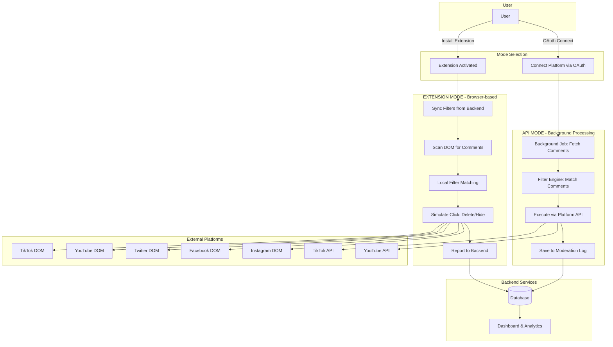
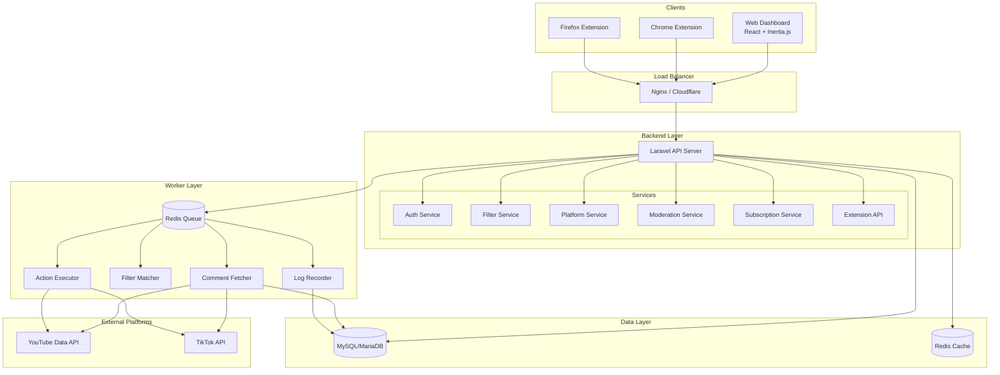
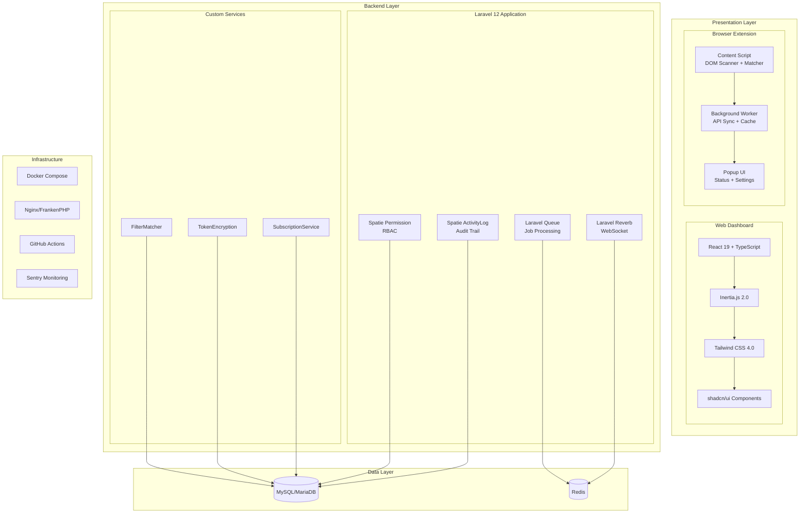
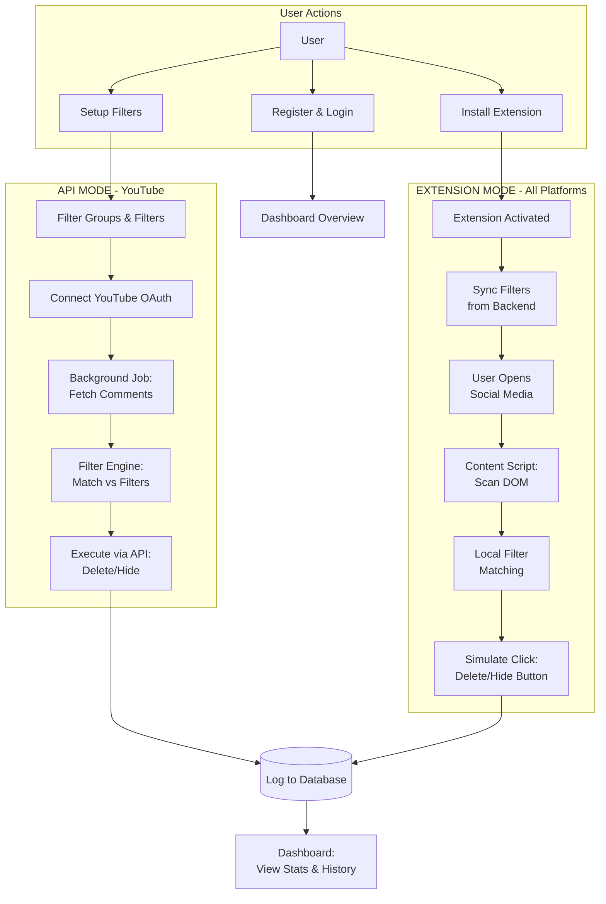

# HapusKomen – Technical Documentation

Dokumentasi ini menjelaskan desain sistem untuk layanan SaaS yang melakukan moderasi dan penghapusan komentar secara otomatis di berbagai platform sosial media.

---

## 1. End-to-End Flow

### 1.1. Deskripsi Flow

HapusKomen memiliki **dua mode operasi** yang dapat digunakan secara bersamaan:

#### Mode A: API Mode (OAuth Connected)

1. **Platform Connection**
   - User menghubungkan akun sosial media via OAuth (YouTube, TikTok).
   - Backend menyimpan access token (encrypted) untuk platform tersebut.
   - Sistem mendaftarkan scheduled job untuk monitoring komentar.

2. **Comment Fetching**
   - Background job secara berkala fetch komentar baru dari Platform API.
   - Komentar disimpan sementara untuk diproses.

3. **Filter Matching**
   - Setiap komentar dijalankan melalui Filter Engine.
   - Engine mencocokkan dengan semua filter aktif user (keyword, regex, username, dll).
   - Komentar yang match ditandai dengan action yang sesuai (delete/hide/flag).

4. **Action Execution**
   - Sistem menjalankan action via Platform API.
   - Hasil dicatat di Moderation Log.

5. **Notification & Reporting**
   - Dashboard menampilkan statistik dan history moderasi.
   - User dapat melihat detail setiap komentar yang di-moderate.

#### Mode B: Extension Mode (Shadow Agent)

1. **Extension Setup**
   - User install browser extension HapusKomen.
   - Extension login ke backend menggunakan extension token.
   - Filter disinkronisasi ke local storage extension.

2. **DOM Scanning**
   - Saat user membuka halaman sosmed (Instagram, Facebook, Twitter, YouTube, TikTok), extension aktif.
   - Content script scan DOM untuk menemukan elemen komentar.
   - Teks komentar diekstrak dari struktur HTML platform.

3. **Local Filter Matching**
   - Extension menjalankan filter matching secara lokal menggunakan cached filters.
   - Komentar yang match di-highlight atau langsung di-process.

4. **Action Execution (Shadow)**
   - Extension mensimulasikan aksi user (klik tombol delete/hide pada UI platform).
   - Dari sisi platform, terlihat seperti user yang menghapus secara manual.
   - Tidak memerlukan OAuth karena menggunakan session login user yang sudah ada.

5. **Logging & Sync**
   - Extension mengirim log ke backend untuk recording.
   - Statistik tersedia di dashboard web seperti mode API.

### 1.2. Flow Diagram

---

## 2. High-Level System Architecture

### 2.1. Komponen Utama

**Frontend (Web Dashboard)**
- Web UI untuk manage filters, melihat logs, dan konfigurasi akun.
- Dashboard analytics dengan statistik moderasi real-time.
- Manage connected accounts dan subscription plans.
- Built dengan React + Inertia.js + TypeScript.

**Browser Extension**
- Chrome/Firefox extension untuk Shadow Mode.
- Content script untuk DOM scanning dan manipulation.
- Background service worker untuk sync dengan backend.
- Popup UI untuk quick settings dan status monitoring.

**API / Backend Service**
- Endpoints:
  - `POST /api/auth` untuk authentication.
  - `GET /api/filters` untuk mengambil filters (web & extension).
  - `POST /api/moderation-logs` untuk record action dari extension.
  - `GET /api/platforms` untuk list connected platforms.
  - `POST /api/platforms/{id}/connect` untuk OAuth flow.
  - `GET /api/stats` untuk dashboard statistics.
- Mengelola auth, multi-tenant, rate limiting, subscription enforcement.

**Job Queue & Workers**
- Queue (Redis) menyimpan job processing.
- Workers menjalankan: Comment Fetching → Filter Matching → Action Execution → Logging.
- Scheduled jobs untuk polling Platform API berdasarkan subscription tier.

**Filter Engine**
- Core service untuk pattern matching.
- Support multiple filter types: keyword, phrase, regex, username, URL, emoji spam, repeat chars.
- Configurable match types: exact, contains, starts_with, ends_with, regex.
- Priority-based execution untuk handling overlapping filters.

**Storage & Database**
- Database (MySQL/MariaDB):
  - User accounts & subscriptions
  - Platform connections (encrypted tokens)
  - Filter configurations
  - Moderation logs & statistics
- Cache (Redis):
  - Session data
  - Filter cache untuk extension sync
  - Rate limiting counters
  - Job queue management

### 2.2. Architecture Diagram

---

## 3. Stack Teknologi

### 3.1. Ringkasan Stack

**Backend**
- Framework: Laravel 12 (PHP 8.2+).
- API Style: RESTful + Inertia.js untuk SSR.
- Queue: Laravel Queue dengan Redis driver.
- Real-time: Laravel Reverb (WebSocket) untuk live updates.

**Database & Storage**
- Primary DB: MySQL 8 / MariaDB 11.
- Cache & Queue: Redis 7.
- File Storage: Local / S3-compatible untuk export logs.

**Frontend (Web Dashboard)**
- Framework: React 19 + TypeScript 5.7.
- SSR: Inertia.js 2.0.
- Styling: Tailwind CSS 4.0.
- Components: shadcn/ui + Radix UI.
- Tables: DataTables.net (server-side pagination).
- Icons: Lucide React.

**Browser Extension**
- Manifest: V3 (Chrome) / V2 (Firefox compatibility).
- Language: TypeScript.
- Build Tool: Vite.
- Components:
  - Content Script: DOM scanning & manipulation.
  - Background Service Worker: API sync & messaging.
  - Popup: Quick settings UI.

**Filter Engine**
- Pattern Matching:
  - Keyword/Phrase: String matching dengan case-sensitive option.
  - Regex: PCRE (PHP backend) / JavaScript RegExp (extension).
  - Username: Exact atau partial match.
  - URL: Domain extraction + pattern matching.
  - Emoji Spam: Emoji density detection.
  - Repeat Chars: Pattern detection untuk karakter berulang.

**Platform Integrations**
- YouTube: YouTube Data API v3 (OAuth 2.0).
- TikTok: TikTok API for Business.
- Instagram/Facebook/Twitter: Extension-only (tidak ada public moderation API).

**DevOps & Infrastructure**
- Container: Docker + Docker Compose.
- Web Server: Nginx / FrankenPHP.
- CI/CD: GitHub Actions.
- Monitoring: Laravel Telescope (dev), Sentry (prod).

### 3.2. Stack Diagram

---

## 4. MVP Design

### 4.1. Ruang Lingkup MVP

**Fokus MVP:** Auto-moderation komentar dengan dual-mode (API + Extension) untuk platform prioritas.

**Fitur MVP:**

- **Web Dashboard:**
  - User registration & authentication.
  - Filter management (CRUD filter groups & individual filters).
  - Preset filters (spam, profanity) yang bisa di-import langsung.
  - Connected accounts management.
  - Moderation logs viewer dengan statistik dasar.
  - Basic subscription tier (Free).

- **Extension (Shadow Mode):**
  - Chrome extension dengan Manifest V3.
  - Support YouTube & Instagram sebagai prioritas awal.
  - DOM scanning untuk mendeteksi komentar.
  - Local filter matching menggunakan cached filters.
  - Delete/hide action simulation.
  - Log reporting ke backend.

- **API Mode:**
  - YouTube API integration via OAuth.
  - Background job untuk comment fetching.
  - Automated filter matching & action execution.

- **Filter Engine:**
  - Keyword matching (exact, contains).
  - Phrase matching.
  - Basic regex support.
  - Username blacklist.
  - Case-sensitive/insensitive option.

**Yang Belum di-MVP-kan:**
- TikTok, Facebook, Twitter integration.
- Advanced regex & URL pattern detection.
- Emoji spam detection.
- Repeat character detection.
- Multi-user collaboration / team features.
- Advanced analytics & data export.
- Stripe subscription integration.
- Mobile app.

### 4.2. MVP Flow Diagram

---

## 5. Catatan Implementasi

Untuk versi awal, cukup:

- **Backend:** Laravel 12 dengan existing models (User, Platform, Filter, FilterGroup, ModerationLog, Plan, Subscription).
- **Queue:** Redis + Laravel Queue untuk background processing.
- **YouTube Integration:**
  - OAuth 2.0 untuk mendapatkan access token.
  - YouTube Data API v3 untuk fetch comments dan execute moderation.
  - Quota tracking karena YouTube API memiliki daily quota limit.
- **Extension:**
  - Manifest V3 untuk Chrome (prioritas).
  - Content script untuk YouTube dan Instagram DOM scanning.
  - Background service worker untuk filter sync dan log reporting.
  - Popup UI sederhana untuk status dan toggle on/off.
- **Filter Matching:**
  - Start dengan keyword dan phrase matching.
  - Case-insensitive sebagai default.
  - Priority-based execution (filter dengan priority tinggi diproses duluan).

**Optimasi berikutnya:**
- Tambah batching untuk multiple comment actions.
- Parallel processing untuk scanning multiple videos/posts.
- Tambah platform lain (TikTok API, Instagram/Facebook/Twitter extension).
- Implementasi advanced filter types (emoji spam, repeat chars, URL patterns).

---

## 6. Analisis & Rekomendasi Perbaikan (Tambahan AI)

Berdasarkan desain di atas, berikut adalah analisis kritikal untuk meningkatkan keberhasilan MVP:

### 6.1. Masalah Rate Limiting Platform API (Critical Issue)

Setiap platform memiliki rate limit yang ketat:
- **YouTube:** 10,000 quota units/hari (1 comment delete = 50 units, artinya maksimal ~200 delete/hari).
- **TikTok:** Rate limit bervariasi dan umumnya sangat ketat untuk write operations.

Jika user memiliki channel besar dengan ribuan komentar spam, quota API bisa habis dalam hitungan menit.

**Solusi MVP:**
1. **Quota Tracking:** Implementasi counter untuk track penggunaan API per user per hari.
2. **Smart Prioritization:** Proses komentar berdasarkan severity filter (priority tinggi duluan), bukan FIFO.
3. **Hybrid Fallback:** Jika quota API mendekati limit, prompt user untuk switch ke Extension Mode sebagai fallback yang tidak terkena rate limit.

### 6.2. Masalah DOM Structure Changes (Critical Issue)

Platform sosial media sering mengubah struktur DOM mereka (class names, element IDs, nesting structure). Extension yang mengandalkan fixed CSS selectors akan break setiap kali platform update UI.

**Solusi:**
1. **Resilient Selectors:** Gunakan kombinasi multiple selectors dengan fallback strategy, bukan single hardcoded selector.
2. **Remote Selector Config:** Simpan DOM selectors di backend yang bisa di-update tanpa perlu publish extension baru ke store.
3. **Graceful Degradation:** Jika DOM detection gagal total, tampilkan mode manual dimana user bisa select komentar untuk di-review.

### 6.3. Masalah Token Security (Critical Issue)

Access token platform (YouTube, TikTok) sangat sensitif. Jika token bocor, attacker bisa mengakses dan memodifikasi channel user tanpa izin.

**Solusi:**
1. **Encryption at Rest:** Semua token harus di-encrypt sebelum disimpan ke database (sudah ada TokenEncryptionService).
2. **Automatic Token Refresh:** Implementasi refresh token sebelum expiry untuk menghindari re-authentication.
3. **Minimal Scopes:** Hanya request OAuth scopes yang benar-benar diperlukan untuk comment moderation, bukan full channel access.

### 6.4. Masalah False Positive pada Filter Matching

Filter keyword sederhana sering menghasilkan false positive:
- Filter "spam" akan match komentar "I love spam (the food)".
- Filter "bad" akan match komentar "not bad at all, great video!".

**Solusi:**
1. **Whole Word Matching:** Tambahkan opsi "whole word only" yang menggunakan word boundary dalam matching.
2. **Negative Patterns:** Tambahkan fitur exclude patterns per filter (contoh: match "spam" tapi exclude jika ada "food" atau "not spam").
3. **Confidence Mode (Future):** Untuk MVP lanjutan, integrasikan LLM-based scoring untuk komentar yang borderline/ambigu.

### 6.5. Masalah Extension Authentication

Extension tidak bisa menggunakan session cookie seperti web app karena berjalan di context yang berbeda (cross-origin). Perlu mekanisme auth yang aman untuk extension.

**Solusi:**
1. **Extension Token:** Generate unique token per user khusus untuk extension authentication.
2. **Token-based Auth:** Extension mengirim token di header setiap request ke backend.
3. **Token Rotation:** Implementasi periodic token rotation untuk security tambahan.

### 6.6. Strategi Worker Separation

Jika comment fetching, filter matching, dan action execution dijalankan di worker yang sama, satu proses yang lambat bisa blocking proses lainnya.

**Solusi:**
- Pisahkan worker berdasarkan task type:
  - **Fetcher Worker:** Khusus untuk fetch comments dari Platform API.
  - **Matcher Worker:** Khusus untuk filter matching (CPU-bound).
  - **Executor Worker:** Khusus untuk execute actions ke Platform API.
  - **Logger Worker:** Khusus untuk write logs ke database.
- Setiap worker type bisa di-scale independently sesuai kebutuhan.

---

*Dokumentasi ini di-generate untuk HapusKomen MVP Development.*

*Last updated: December 2024*
